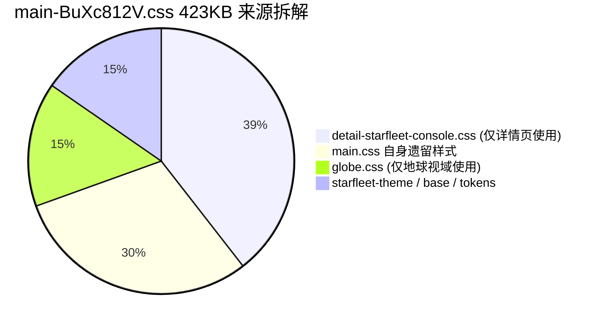

# 前端太阳系与三维地球视图交互优化设计方案

---

## 总体设计原则与架构约束

1. **多渲染器视口隔离（Multi-Renderer Viewport Isolation）**：
   - 太阳系视图为独立 Three.js 实例与 rAF 循环（[`SolarSystem.js`](file:///tmp/vps-dashboard-review/frontend-vite/src/components/SolarSystem.js)）；
   - 地球视图为独立 Cesium 实例（[`CesiumGlobe.js`](file:///tmp/vps-dashboard-review/frontend-vite/src/components/CesiumGlobe.js)）；
   - 星舰展示为独立 Three.js 实例（[`StarshipShowcase.js`](file:///tmp/vps-dashboard-review/frontend-vite/src/components/StarshipShowcase.js)）。
   - **绝不合并渲染器**，保持视口切换时的显隐互斥与帧循环暂停/恢复。
2. **移动端保底策略**：
   - 视口宽度 $\le 720\text{px}$ 时跳过星舰挂载；
   - 限制抗锯齿与像素比上限（DPR 1.5），缩减天体几何分段数。
3. **CI 质量门禁兼容**：
   - 严格遵循 [`verify-vendor-chunk-budget.mjs`](file:///tmp/vps-dashboard-review/frontend-vite/scripts/verify-vendor-chunk-budget.mjs) 的 1372 KiB 阈值；
   - 严格维护 [`verify-solar-system-home.mjs`](file:///tmp/vps-dashboard-review/frontend-vite/scripts/verify-solar-system-home.mjs)、[`verify_solar_system_behavior.py`](file:///tmp/vps-dashboard-review/frontend-vite/scripts/verify_solar_system_behavior.py) 和 [`verify_solar_hit_targets.py`](file:///tmp/vps-dashboard-review/frontend-vite/scripts/verify_solar_hit_targets.py) 的既有契约断言。

---

## F1：地球 → 太阳系返回交互设计方案

### 1. 改动文件清单
- [`frontend-vite/src/modules/serverTable.js`](file:///tmp/vps-dashboard-review/frontend-vite/src/modules/serverTable.js)：DOM 挂载、显隐状态控制、键盘与点击事件绑定。
- [`frontend-vite/src/styles/globe.css`](file:///tmp/vps-dashboard-review/frontend-vite/src/styles/globe.css)：返回按钮与引导提示气泡的样式与响应式布局。
- [`frontend-vite/src/core/preferences.js`](file:///tmp/vps-dashboard-review/frontend-vite/src/core/preferences.js)：多语言文案字典扩展（zh / en / ja / ko / es / fr / de / ru）。

---

### 2. 具体改动点（函数级）

#### 2.1 DOM 骨架与挂载改造
- **函数**：[`serverTable.js:mountDisplayPage()`](file:///tmp/vps-dashboard-review/frontend-vite/src/modules/serverTable.js#L360-L376)
- **设计**：
  在 `.globe-overlay-layer` 内新增两组节点：
  1. `<button id="globeReturnSolarBtn" class="globe-nav-back-btn" type="button" aria-label="返回太阳系视图（快捷键 Esc）" style="display:none">`：可见返回按钮。
  2. `<aside id="globeFirstEntryToast" class="globe-entry-toast" role="status" aria-live="polite" style="display:none">`：首次进入地球的操作引导气泡。

#### 2.2 视图显隐联动与按钮状态控制
- **函数**：[`serverTable.js:showCesiumGlobe()`](file:///tmp/vps-dashboard-review/frontend-vite/src/modules/serverTable.js#L571-L582)
  - 触发地球视图呈现时：
    - 将 `#globeReturnSolarBtn` 的 `style.display` 切换为 `flex`（或加入 `.is-active` 类名）。
    - 检查会话标记 `sessionStorage.getItem('vps_seen_globe_guide')`：若未设置，则唤起 `#globeFirstEntryToast`，展示文案并在 4.5 秒后自动淡出隐藏，写入标记防止后续重复干扰。
- **函数**：[`serverTable.js:showSolarSystem()`](file:///tmp/vps-dashboard-review/frontend-vite/src/modules/serverTable.js#L556-L570)
  - 切换回太阳系视图时：
    - 强制隐藏 `#globeReturnSolarBtn`（`style.display = 'none'`）。
    - 若 `#globeFirstEntryToast` 正在计时显示，立即清除定时器并隐藏。
- **函数**：[`serverTable.js:initGlobe()`](file:///tmp/vps-dashboard-review/frontend-vite/src/modules/serverTable.js#L588-L606)
  - 为 `#globeReturnSolarBtn` 绑定点击事件：直接调用现有的 `showSolarSystem()`。
  - 保留并复用现有的 `solarEscapeHandler` 键盘监听，保持 Esc 键的双向连贯性。

#### 2.3 事件隔离与接线（解决与 onBlankClick/节点点击的冲突）
- **事件隔离原则**：
  - `.globe-overlay-layer` 默认样式为 `pointer-events: none`。
  - `#globeReturnSolarBtn` 设置 `pointer-events: auto`。
  - 绑定 `pointerdown`、`mousedown`、`click` 事件，在回调中显式调用 `event.stopPropagation()` 和 `event.preventDefault()`。
  - **冲突规避机理**：Cesium 的拾取依赖在 `viewer.scene.canvas` 上挂载的 `ScreenSpaceEventHandler`。将按钮置于顶层 DOM 并在 pointer 阶段拦截冒泡，事件不会传递至底层的 Cesium Canvas，绝不会误触发 `CesiumGlobe.onBlankClick`（导致折叠卡片被关）或天体反选。

#### 2.4 视觉与布局规格
- **停靠位置**：
  - 桌面端：左上角 `top: 22px; left: 24px;`（与左下角 `globeFocusBadge` [22px, 24px] 形成上下呼应，完全避开右侧星舰与中央地球视域）。
  - 移动端（$\le 720\text{px}$）：`top: max(14px, env(safe-area-inset-top)); left: 16px;`。
- **视觉风格**：
  - 继承星舰控制台主题（Starfleet Glassmorphism）：深蓝半透明背景 `rgba(4, 10, 20, 0.78)`、超细蓝光边框 `1px solid rgba(125, 211, 252, 0.25)`、高斯模糊 `backdrop-filter: blur(14px)`、微发光边角与胶囊药丸圆角（`border-radius: 999px`）。
- **文案与提示建议**：
  - **按钮文案**：
    - 桌面端：`← 太阳系 (Esc)`
    - 移动端：`← 太阳系`
  - **首次进入气泡提示文案**：
    - 桌面端：`已进入行星地面视域。按 Esc 或点击左上方可返回太阳系；滚轮缩放，拖拽旋转地球。`
    - 移动端：`已进入地球视域。点击左上角「← 太阳系」返回；双指捏合缩放，单指拖动。`

---

### 3. 风险与边界
1. **太阳系下泄露可见（视觉闪烁风险）**：
   - 边界：页面初次加载时为太阳系，HTML 默认内联 `style="display:none"`，防止 CSS 未完全就绪时的 FOUC 闪烁。
2. **移动端安全区与星舰遮挡**：
   - 移动端已在 `serverTable.js` L469 跳过星舰挂载，左上角拥有完全干净的操作区域，只需处理刘海屏安全区 `env(safe-area-inset-top)`。
3. **回归风险保护**：
   - 保证 `verify_solar_system_behavior.py` 中的 Check B（Earth -> Cesium -> Escape 双轮往返测试）完全不受影响。

---

### 4. 验收标准（可测断言）
- **[断言 1] 太阳系视图隐身**：在太阳系激活状态下，`getComputedStyle(document.getElementById('globeReturnSolarBtn')).display === 'none'`。
- **[断言 2] 地球视图可见且可达**：点击地球且 Cesium 加载完毕后，`document.getElementById('globeReturnSolarBtn')` 的 `display !== 'none'`，且 `getBoundingClientRect().width > 0`。
- **[断言 3] 点击按钮返回太阳系**：在地球视图下模拟点击 `#globeReturnSolarBtn`，`#globe-container` 切换为隐藏，`#solar-system-container` 重新可见，`window.__DBG__.solarSystem.running === true`。
- **[断言 4] Esc 键等效性**：按 Esc 键与点击按钮触发完全相同的 `showSolarSystem()` 调度链路。
- **[断言 5] 点击隔离无副作用**：点击 `#globeReturnSolarBtn` 时，不触发 `CesiumGlobe.onBlankClick`，不改变已聚焦的服务器选中状态。

---

## F2：SolarSystem 交互增强设计方案

### 1. 改动文件清单
- [`frontend-vite/src/components/SolarSystem.js`](file:///tmp/vps-dashboard-review/frontend-vite/src/components/SolarSystem.js)：相机轨道计算、手势事件监听、Tween 中断、行星标签与光晕渲染。
- [`frontend-vite/src/styles/starfleet-theme.css`](file:///tmp/vps-dashboard-review/frontend-vite/src/styles/starfleet-theme.css)：行星名称指示器与交互状态样式。

---

### 2. 具体改动点（函数级）

#### 2.1 拖拽旋转 + 滚轮缩放方案选型评估
- **选型结论**：**坚决自研 35 行轻量级球坐标相机轨道控制器，严禁引入 `three/addons/controls/OrbitControls`**。
- **论证与 Bundle 影响**：
  1. **Vendor Chunk 预算红线**：
     [`verify-vendor-chunk-budget.mjs`](file:///tmp/vps-dashboard-review/frontend-vite/scripts/verify-vendor-chunk-budget.mjs#L56-L60) 限制 `vendor-*.js` 体积上限为 $1372\text{ KiB}$（$1,404,928\text{ 字节}$）。当前已构建包体为 $1,338,539\text{ 字节}$，**剩余安全裕量仅剩 64.8 KB**。
     `OrbitControls.js` 源码长达 1964 行，依赖 `Controls`、`Spherical`、`Plane`、`Ray` 等模块。由于 `vite.config.js` 的 `manualChunks` 规定 `id.includes('node_modules') => 'vendor'`，引入 OrbitControls 将直接增加 20~25 KB 的 vendor chunk 体积，吃掉近 40% 的仅存缓冲，稍有依赖更新即会击穿 ratchet 门禁。
  2. **CI 状态机契约冲突**：
     [`verify-solar-system-home.mjs`](file:///tmp/vps-dashboard-review/frontend-vite/scripts/verify-solar-system-home.mjs#L79-L85) 明确断言 `cameraAtHome` 的 `true` 赋值只能出现在 `constructor` 和 `_snapToHome()`。OrbitControls 的黑盒事件体系无法配合该状态机。
- **轻量实现要点**：
  - 在 `SolarSystem` 实例内部维护球坐标状态：
    ```javascript
    this.orbitState = {
      spherical: new THREE.Spherical(baseRadius, Math.PI / 3, 0),
      isDragging: false,
      pointerStart: new THREE.Vector2(),
      dragMoved: false
    };
    ```
  - 偏航与俯仰限制：`phi` 夹紧在 $[0.15, \pi/2 - 0.08]$（保持始终由上方俯瞰黄道面，防止翻入星盘下方导致方向错乱）；
  - 缩放半径限制：`radius` 夹紧在 $[25, 140]$ 之间；
  - 零额外内存开销，代码合并入 `SolarSystem.js`（归属于 `components` chunk，vendor chunk 0 增量）。

#### 2.2 悬停高亮 + 行星名称标签与现有 `_syncHitButtons` 的共存设计
- **核心冲突与穿透考量**：
  - [`verify_solar_hit_targets.py`](file:///tmp/vps-dashboard-review/frontend-vite/scripts/verify_solar_hit_targets.py#L59) 使用 Chromium CDP 执行 `document.elementFromPoint(cx, cy)`，要求在命中天体中心和目标点时，返回的 DOM 元素必须全等（`ch === el`）于 `button.solar-system-hit`。
  - 若在外部新增未加控制的 DOM 标签，会截断命中检测，导致自动化测试即刻报错。
- **共存方案设计**：
  1. **Aria 可达层与视觉表现层分离**：
     - `button.solar-system-hit` 保留为透明、无边框、用于支持键盘 Tab 聚焦和无障碍屏幕阅读器的**原生交互层**。
     - 行星视觉标签（如 `Earth 地球`、`Sun 太阳`）渲染为单独的浮动标签 DOM 列表（或挂载在 container 下的视觉 HUD 层），其样式必须声明：
       `pointer-events: none !important;`
     - **穿透保证**：因设置了 `pointer-events: none`，无论是用户真实点击还是 CDP 的 `document.elementFromPoint`，都会无条件穿透视觉标签，精准命中底层的 `button.solar-system-hit` 或 Three.js Canvas。
  2. **位置同步（复用 `_syncHitButtons` 投影循环）**：
     - 函数：[`SolarSystem._syncHitButtons()`](file:///tmp/vps-dashboard-review/frontend-vite/src/components/SolarSystem.js#L480-L542)
     - 在现有遍历投影位置的循环中，直接读取已算好的 `left`、`top` 屏幕像素坐标，同步赋值给视觉标签，避免多余的矩阵变换计算。
  3. **3D 场景高亮反馈**：
     - 在 Three.js 场景中为 Sun、Earth、Moon 预置微弱的菲涅尔边缘光外壳（Fresnel Halo Mesh）或在 Hover 时动态提升材质的 `emissive` 亮度（从 0 提至 0.35），指针移出后平滑回落。

#### 2.3 与 `_approachEarth` Tween 的协调与打断策略
- **函数**：[`SolarSystem._approachEarth()`](file:///tmp/vps-dashboard-review/frontend-vite/src/components/SolarSystem.js#L383-L403) 与 [`SolarSystem._stepCameraTween()`](file:///tmp/vps-dashboard-review/frontend-vite/src/components/SolarSystem.js#L405-L430)
- **打断策略（Tween Interrupt Strategy）**：
  - 当 `this.cameraTween` 处于运行状态（0.4 秒内），如果用户触发了人为干预（指针拖拽位移超过 4px，或触发滚轮 `wheel`，或触屏双指手势）：
    1. **清除 Tween**：立即执行 `this.cameraTween = null`；
    2. **接管姿态**：从当前瞬时相机位置计算球坐标参数同步给 `orbitState`，使相机平滑停在打断位置，不产生瞬间跳变；
    3. **拦截回调**：打断后不再执行 `this.options.onEarthClick()`，取消向地球视图的强制跳转；
    4. **状态标定**：确保 `this.cameraAtHome = false`。用户后续再次点击地球时，允许从当前自由视角再次发起 `_approachEarth()`。

#### 2.4 移动端触屏（Touch）手势最小支持
- **函数**：[`SolarSystem._bindEvents()`](file:///tmp/vps-dashboard-review/frontend-vite/src/components/SolarSystem.js#L338-L348)
  - 注册 `touchstart`、`touchmove`、`touchend` 事件，添加 `{ passive: false }`：
    - **单指接触**：记录初始点坐标；在移动超过 6px 时，视为旋转手势，调用 `event.preventDefault()` 阻止系统默认滚动，并驱动偏航/俯仰角改变。
    - **双指接触**：记录两点距离 $D = \sqrt{(x_1-x_2)^2 + (y_1-y_2)^2}$；移动时根据当前距离与上一帧距离比率缩放相机轨道半径。
    - **轻触判别（Tap）**：若从 touchstart 到 touchend 位移小于 6px 且时长小于 250ms，视为天体点击，走原有拾取逻辑。

#### 2.5 性能红线约束
- **单一 rAF 循环**：所有相机轨道位置更新、阻尼衰减均直接在现有的 `_tick()`（L433-451）内部单步执行，**严禁使用独立的动画循环**。
- **单一渲染器**：始终复用单一 `WebGLRenderer`。
- **Resize 复用**：窗口缩放完全收敛于现有 `resize()`（L595-618），重新适应 aspect 并按视口比拉伸基准距离。

---

### 3. 风险与边界
1. **CDP 测试破坏风险（最关键红线）**：
   - 行星标签与发光元素若漏设 `pointer-events: none`，会导致 `scripts/verify_solar_hit_targets.py` 中心点测试 100% 失败。
2. **Hit Buttons 分离距离扰动**：
   - 地月接近时有日月重叠分离算法（L524-535）。视觉标签需跟随分离后的按钮偏移量，避免文字互相重叠覆盖。
3. **极角越界奇点（Gimbal Lock）**：
   - 俯仰角 `phi` 不得等于 0 或 $\pi$，否则会导致相机上向量与视线共线引发抖动。设计上强制限制在 $[0.15, \pi/2 - 0.08]$。

---

### 4. 验收标准（可测断言）
- **[断言 1] 拖拽引起相机角度改变**：在 Canvas 上模拟派发 `pointerdown` + `pointermove(dx=50)`，相机 `position.x` 与 `position.z` 发生符合旋转预期的变化，且 `window.__DBG__.solarSystem.cameraAtHome === false`。
- **[断言 2] 滚轮引起半径缩放**：模拟派发 `wheel(deltaY=100)`，相机到原点距离增加，且值保持在 $[25, 140]$ 边界内。
- **[断言 3] 测试用例 100% 通过**：运行 `python3 scripts/verify_solar_hit_targets.py`，三个核心天体的 `center` 和 `target` 命中率保持 100%，无 geometry 冲突。
- **[断言 4] 拖拽打断 Tween**：点击地球后 100ms 内触发拖拽，`window.__DBG__.solarSystem.cameraTween` 变为 `null`，且不触发 `onEarthClick` 跳转。
- **[断言 5] 渲染器与 rAF 不超标**：运行 `node scripts/verify-solar-system-home.mjs`，断言 `new THREE.WebGLRenderer` 与 `requestAnimationFrame` 数量仍严格保持为 1。

---

## F3：54MB xinjian1.glb 压缩与可靠加载设计

### 1. 改动文件清单
- [`frontend-dist/globe/`](file:///tmp/vps-dashboard-review/frontend-dist/globe/)：产物目录新增压缩版模型文件 `xinjian1-opt.glb`。
- [`frontend-vite/src/components/StarshipShowcase.js`](file:///tmp/vps-dashboard-review/frontend-vite/src/components/StarshipShowcase.js)：模型加载链路、格式探测、错误重试与降级逻辑。
- [`frontend-vite/src/components/starship/ShipMaterials.js`](file:///tmp/vps-dashboard-review/frontend-vite/src/components/starship/ShipMaterials.js)：配合压缩模型后的纹理重建适配。
- [`frontend-vite/src/modules/serverTable.js`](file:///tmp/vps-dashboard-review/frontend-vite/src/modules/serverTable.js)：更新 `fallbackModelUrl` 声明。
- [`frontend-vite/scripts/verify-solar-system-home.mjs`](file:///tmp/vps-dashboard-review/frontend-vite/scripts/verify-solar-system-home.mjs)：调整静态断言以匹配回退配置。
- 新增验证脚本：`frontend-vite/scripts/verify-gltf-pipeline.mjs`。

---

### 2. 具体改动点（函数级）

#### 2.1 压缩技术路线取舍建议（meshopt vs Draco vs KTX2）

| 压缩方案 | 针对目标 | 体积预期 (55MB 原生) | 解码开销 / 依赖文件 | 本项目适配评估结论 |
| :--- | :--- | :--- | :--- | :--- |
| **Draco** (`KHR_draco`) | 仅几何体 | ~46MB (网格压至 1MB，纹理未变) | 需额外引入 `draco_decoder.wasm` (~150KB)，CPU 运算重 | **不推荐**。55MB 中纹理占 80% 以上，Draco 无法解决纹理大头问题。 |
| **KTX2** (`KHR_texture_basisu`) | 仅纹理 | ~14MB (纹理大幅压缩，显存降低) | 需 `KTX2Loader` + `basis_transcoder.wasm` (~250KB) | **次选**。压缩比优秀但引入庞大转码器，且与现有 `_rehydrateGltfTextures` 冲突。 |
| **Meshopt** (`EXT_meshopt`) | 仅几何体 | ~48MB (几何量化与极速解码) | 需 `MeshoptDecoder` (WASM ~20KB) | 适合几何，但无法单兵作战。 |
| **WebP 纹理替换 + Meshopt (推荐方案)** | **几何 + 纹理兼顾** | **8MB ~ 11MB (降幅 >80%)** | 浏览器原生支持 WebP 解码，`createImageBitmap` 零缝隙兼容 | **最强推荐**：低风险、高性能、高压缩率、对运行时侵入最小。 |

- **详细取舍论证**：
  取证发现 [`ShipMaterials.js:L28-L30`](file:///tmp/vps-dashboard-review/frontend-vite/src/components/starship/ShipMaterials.js#L28-L30) 深度依赖从 GLB bufferView 提取二进制并调用 `createImageBitmap(blob)` 动态重构材质。
  - 若采用 KTX2，原生 `createImageBitmap` 无法直接解码，会导致必须重构整套材质重塑机制，引发未知渲染回归。
  - 若采用 **WebP 纹理重编码（质量 85%） + 尺寸降级至 1024/1536px + meshopt 几何压缩**：
    1. 纹理体积直接从 44MB 缩减至 6.5MB；
    2. 几何网格从 10MB 缩减至 2.5MB；
    3. 整体模型压缩至 **9MB 左右**；
    4. 现代浏览器完全原生硬解 WebP，无需载入几百 KB 的外部 WASM Transcoder，无多余网络往返。

#### 2.2 线上 GLTFLoader 解码路径验证方案（验证脚本要点）
- **验证痛点（Spike 结论）**：
  若在 GLTF 中启用了扩展扩展名（如 `EXT_meshopt_compression`），如果客户端代码未配置解码器或生产静态资源未部署解码器 WASM，GLTFLoader 会直接抛出 `THREE.GLTFLoader: Unsupported extension` 导致星舰彻底加载失败。
- **验证脚本设计（`scripts/verify-gltf-pipeline.mjs`）**：
  1. **构建产物静态扫描**：
     - 检查 `frontend-dist/globe/xinjian1-opt.glb` 是否存在，文件大小断言在 $6\text{MB} \sim 15\text{MB}$ 之间；
     - 检查 `frontend-dist/` 下配套的解码器资产（若使用 Meshopt，校验 `meshopt_decoder.module.js` 或 wasm 映射）是否存在；
  2. **端到端加载探针测试（Headless Chromium via CDP）**：
     - 使用独立临时端口启动本地静态托管服务；
     - 监听网络请求流，断言 `xinjian1-opt.glb` 成功返回 HTTP 200，无 404；
     - 轮询前端探针 `window.__DBG__.starshipLoaded === true`；
     - 校验 `window.__DBG__.starshipTextureInventory.withMap > 0` 且 `window.__DBG__.starshipError` 为空，确保贴图无白模、黑模、丢贴图现象。

#### 2.3 健壮的双轨回退策略（Fallback Strategy）
- **函数**：[`StarshipShowcase._loadModel()`](file:///tmp/vps-dashboard-review/frontend-vite/src/components/StarshipShowcase.js#L265-L290) 与 [`serverTable.js:getGlobe()`](file:///tmp/vps-dashboard-review/frontend-vite/src/modules/serverTable.js#L493-L495)
- **架构设计**：
  ```javascript
  // serverTable.js 挂载参数设计
  starshipShowcase = new StarshipShowcase(stage, {
    modelUrl: '/globe/xinjian1-opt.glb?v=20260909',
    fallbackModelUrl: '/globe/xinjian1.glb?v=20260728',
    deferMs: 1200,
  });
  ```
- **回退触发分支**：
  1. **网络级失败**：CDN 404、5xx 错误、网络中断；
  2. **解码级失败**：GLTF 解析抛错、扩展不识别；
  3. **材质重构级失败**：`_finishModelLoad` 内捕获异常。
- **防震荡控制**：
  - 加载失败进入 catch 块：
    - 若当前加载的是主 URL 且 `fallbackModelUrl` 存在，记录 `window.__DBG__.starshipFallback = fallbackModelUrl`，调用 `_loadModel(fallbackModelUrl, false)`；
    - 第二次加载将 `allowFallback` 置为 `false`，若依然失败直接调用 `_failSoft()` 静默关闭星舰层，保证 Cesium 地球主流程稳定运行，绝不无限重试。

---

### 3. 风险与边界
1. **测试脚本契约破环**：
   - 现状：[`verify-solar-system-home.mjs:L92`](file:///tmp/vps-dashboard-review/frontend-vite/scripts/verify-solar-system-home.mjs#L92) 含有硬编码断言：
     `assert.match(table, /modelUrl: '\/globe\/xinjian1\.glb\?v=20260728'/); assert.match(table, /fallbackModelUrl: ''/);`
   - 边界对策：修改 `modelUrl` 和 `fallbackModelUrl` 时，**必须同步调整该测试脚本的正则表达式匹配**，并在方案设计中标明联动改动。
2. **显存贴图尺寸**：
   - 压缩贴图不能改变纹理纵横比，否则会导致船体 NCC-1822 编号拉伸变形。

---

### 4. 验收标准（可测断言）
- **[断言 1] 包体体积缩减率达标**：压缩后的 `xinjian1-opt.glb` 大小 $\le 12\text{ MB}$（相比 55.5MB 减少 $\ge 78\%$）。
- **[断言 2] 正常路径无回退**：浏览器网络面板观察到请求 `xinjian1-opt.glb` 成功，未发起 `xinjian1.glb` 请求，`window.__DBG__.starshipLoaded === true`。
- **[断言 3] 回退链路可达性**：人为将 `modelUrl` 破坏为 404 路径，控制台打印回退 warning，网络流自动发起对 `fallbackModelUrl` 的请求并成功渲染。
- **[断言 4] 贴图保真度不掉线**：`window.__DBG__.starshipTextureInventory.withMap >= 18`，自发光贴图与引擎尾焰光效完好。

---

## F4：首屏关键资源瘦身设计方案

### 1. 改动文件清单
- [`frontend-vite/src/modules/serverTable.js`](file:///tmp/vps-dashboard-review/frontend-vite/src/modules/serverTable.js)：静态依赖解耦、Chart 组件懒加载、CSS 动态拆离。
- [`frontend-vite/src/pages/detailCharts.js`](file:///tmp/vps-dashboard-review/frontend-vite/src/pages/detailCharts.js)：从主入口静态链中剔除。
- [`frontend-vite/src/components/TrafficChart.js`](file:///tmp/vps-dashboard-review/frontend-vite/src/components/TrafficChart.js)：从主入口组件组中分离。
- [`frontend-vite/vite.config.js`](file:///tmp/vps-dashboard-review/frontend-vite/vite.config.js)：调整 `manualChunks` 代码分割分组策略。
- [`frontend-vite/src/styles/main.css`](file:///tmp/vps-dashboard-review/frontend-vite/src/styles/main.css)：剔除详情页专用样式，实现首屏轻量化。

---

### 2. 具体改动点（函数级）

#### 2.1 Chart.js (203KB) 泄漏至首屏的根因调查与解耦设计
- **深度取证调查结果**：
  1. `TrafficChart.js` 内部虽然编写了 `const mod = await import('chart.js/auto')` 动态导入。
  2. 但在 [`serverTable.js:L11`](file:///tmp/vps-dashboard-review/frontend-vite/src/modules/serverTable.js#L11) 与 [`serverTable.js:L44`](file:///tmp/vps-dashboard-review/frontend-vite/src/modules/serverTable.js#L44) 中：
     - `import { TrafficChart } from '../components/TrafficChart.js';`
     - `const detailCharts = new TrafficChart();`（在模块顶层**无条件立即实例化**！）
  3. 在 [`vite.config.js:L64`](file:///tmp/vps-dashboard-review/frontend-vite/vite.config.js#L64) 中，规则 `if (id.includes('/src/components/')) return 'components';` 将 `SolarSystem.js`（首屏强依赖）与 `TrafficChart.js` 打包进了同一个 `components-*.js` chunk 中。
  4. 构建器将 `chart.js` 识别为 `components` chunk 的动态下级依赖，在生成的 `components-*.js` 头部注入预加载索引表：
     `__vite__mapDeps = ... ["assets/chart-D82F5TVB.js", ...]`
  5. 从而导致浏览器在加载首屏解析组件 chunk 时，直接感知到了图表模块，破坏了首屏纯净度。
- **按需加载改造点**：
  - **改造点 1（破坏静态依赖链）**：
    - 在 `serverTable.js` 中完全删除顶层静态引入：
      - 删除：`import { TrafficChart } from '../components/TrafficChart.js';`
      - 删除：`import { appendDetailLiveMetrics, renderDetailMonitorCharts ... } from '../pages/detailCharts.js';`
      - 删除：顶层立即执行的 `const detailCharts = new TrafficChart();`
  - **改造点 2（按需动态单例初始化）**：
    - 新增函数 `getDetailChartRuntime()`：
      ```javascript
      let detailChartModulePromise = null;
      async function getDetailChartRuntime() {
        if (!detailChartModulePromise) {
          detailChartModulePromise = Promise.all([
            import('../components/TrafficChart.js'),
            import('../pages/detailCharts.js')
          ]).then(([{ TrafficChart }, detailChartsModule]) => {
            return {
              detailCharts: new TrafficChart(),
              ...detailChartsModule
            };
          });
        }
        return detailChartModulePromise;
      }
      ```
    - 仅在用户真正打开详情页（`renderDetailPage()` 或 URL 参数包含 `?server=`）时，`await getDetailChartRuntime()` 按需拉取。
  - **改造点 3（Vite ManualChunks 精细拆分）**：
    - 在 `vite.config.js` 中，将 `TrafficChart.js` 从通用的 `components` 规则中剔除，单独立 chunk 或与 `detailCharts.js` 归并在 `detail-telemetry` 分组中，首屏 `components` 只保留 `SolarSystem`。

#### 2.2 main CSS (423KB) 审计分析与瘦身要点
- **423KB 组成构成解构**：



  1. **最大冗余源头**：[`serverTable.js:L5`](file:///tmp/vps-dashboard-review/frontend-vite/src/modules/serverTable.js#L5) 静态导入了 `import '../styles/detail-starfleet-console.css'`（**167.2 KB**！）。该样式表全篇为网络拓扑矩阵、Ping 柱状图容器、控制台微件等详情页专用样式，首屏根本不渲染这些 DOM，却在首屏全量下载并阻塞 CSSOM 渲染。
  2. **第二大冗余源头**：`main.css` 内部第 9 行 `@import './globe.css'`（**63.8 KB**）。包含 Cesium 实体挂载指示器与地图图层，太阳系阶段完全冗余。
- **拆解与瘦身改造要点**：
  - **要点 1：详情页样式随详情模块动态导入（利用 Vite CSS Code Splitting）**：
    - 从 `serverTable.js` 移除 `import '../styles/detail-starfleet-console.css'` 与 `import '../styles/detail-starmap-background.css'`。
    - 将这两个 CSS 的引用转移到 `src/pages/detailPage.js` 内部。
    - 因 `detailPage.js` 已经是动态懒加载模块，Vite 会自动为其抽取独立的 `detail-*.css`，**直接将首屏 CSS 包体剔除 170 KB**！
  - **要点 2：地球图层样式随 Cesium 模块异步加载**：
    - 将 `globe.css` 从 `main.css` 的 `@import` 中解绑，移入 `src/components/CesiumGlobe.js` 中引入。
    - 地球视图未挂载前，无需支付这 64KB 的解析成本。
  - **瘦身效益**：
    - 首屏阻塞 CSS（`main-*.css`）体积预计从 **423 KB 骤降至约 60 ~ 80 KB**（降幅超 80%），极大加速首屏 FCP。

---

### 3. 风险与边界
1. **详情页初次打开样式闪烁（FOUC）**：
   - 风险：若详情页样式完全异步加载，弱网下打开详情页可能出现短暂的无样式 DOM 布局闪烁。
   - 应对：`index.html` 既有已有保护逻辑：
     `if (new URLSearchParams(window.location.search).has('server')) document.documentElement.classList.add('detail-pending');`
     详情页未加载完成前保持骨架遮罩，确保样式就绪后再移除 pending 状态。
2. **样式覆盖层叠顺序（Cascade Order）**：
   - CSS 拆分为异步 chunk 后，加载顺序发生微调。需确保变量层（`variables.css`）与基底类始终保留在首屏 `main.css` 中，避免组件样式变量失效。

---

### 4. 验收标准（可测断言）
- **[断言 1] 首屏不请求图表 Chunk**：在太阳系首页初次渲染至稳定状态（未进入详情页），自动化网络监听中 **0 处**对 `chart-*.js` 的网络请求。
- **[断言 2] 首屏 CSS 体积控制**：构建产物 `frontend-dist/assets/main-*.css` 的解压后体积小于 $120\text{ KB}$（基线 433 KB）。
- **[断言 3] 详情页图表按需加载依然正常**：导航至某台 VPS 详情页（如 `/?server=1`）时，观察到 `chart-*.js` 异步触发且正确载入，图表（CPU / 内存 / Ping / 流量）成功绘制于各 Canvas 上。
- **[断言 4] CI 预算门禁保持合规**：运行 `npm run test:vendor-chunk-budget`，检查 `vendorBytes < 1404928` 并且各依赖项校验绿灯通过。

---

## 方案改动全景速查

| 特性模块 | 核心改动文件 | 核心技术方案与收益 | 关联测试与约束保护 |
| :--- | :--- | :--- | :--- |
| **F1: 地球→太阳系返回** | `serverTable.js`, `globe.css` | 左上角 Starfleet 风格胶囊按钮 + Esc 双可达性；`stopPropagation` 拦截阻断 Cesium 冒泡；首次会话 Toast 引导。 | 保护 Check B 双向往返测试；太阳系下必须隐藏。 |
| **F2: 太阳系交互增强** | `SolarSystem.js`, `starfleet-theme.css` | 35 行极简球坐标相机轨道（零增 vendor）；标签 `pointer-events: none` 穿透共存；拖拽平滑打断 0.4s Tween；移动端单/双指手势支持。 | 保守 vendor ratchet 预算门禁；保护 CDP `elementFromPoint` 100% 命中率断言。 |
| **F3: 54MB 模型压缩** | `xinjian1-opt.glb`, `StarshipShowcase.js` | WebP 纹理 + Meshopt 几何量化，模型降至 9MB；CDP 生产解码验证脚本；网络/解码故障自动回退原版 GLB。 | 联动修改 `verify-solar-system-home.mjs` 中的 `fallbackModelUrl` 断言。 |
| **F4: 首屏关键资源瘦身** | `serverTable.js`, `detailPage.js`, `main.css` | 斩断 `TrafficChart` 顶层静态导入与实例化；详情页样式随异步 chunk 动态分割；首屏 CSS 体积下降 >80%，首屏彻底移除 `chart.js`。 | 详情页图表绘制功能零回归；保证首屏 FCP 显著提速。 |
EXIT=0
