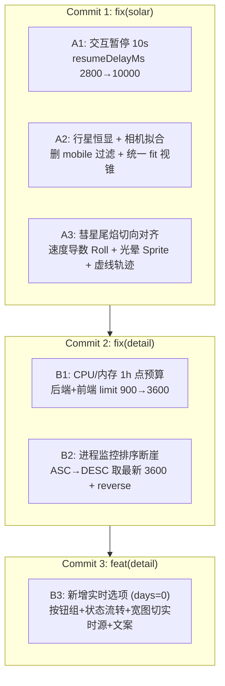

# 太阳系 v3.6 与详情页遥测修复设计契约（Design Contract）

> **契约目标**：规范 3D 太阳系交互恢复、多端星球可见度与拟合、彗星尾焰运动学、以及 VPS 详情页 1h 监控与「实时（days=0）」范围切换的工程设计与断言体系。**本阶段仅确立契约，不直接修改代码。**

---

## 1. 架构变更全景与 Commit 映射



---

## 2. 模块 A：太阳系视觉与交互契约

### A1. 交互后恢复延迟延展至 10s

- **目标文件**：[`frontend-vite/src/components/SolarSystem.js:41`](file:///tmp/vps-dashboard-review/frontend-vite/src/components/SolarSystem.js#L41)
- **现状代码**：
  ```javascript
  this.orbitState = { spherical: new THREE.Spherical(), isDragging: false, pointerStart: new THREE.Vector2(), dragMoved: false, motionState: 'running', resumeTimerId: null, resumeDelayMs: 2800, pauseStartTime: 0 };
  ```
- **契约变更**：
  1. `resumeDelayMs: 2800` → `resumeDelayMs: 10000`。
  2. 保持 [`SolarSystem.js:491-492`](file:///tmp/vps-dashboard-review/frontend-vite/src/components/SolarSystem.js#L491-L492) 的倒计时计算逻辑不变：
     ```javascript
     this.debug.solarOrbitMotionState = this.orbitState.motionState;
     this.debug.solarOrbitResumeRemainingMs = this.orbitState.motionState === 'paused'
       ? Math.max(0, this.orbitState.resumeDelayMs - (Date.now() - this.orbitState.pauseStartTime))
       : 0;
     ```
  3. **测试扫描结果**：经核实，[`verify-solar-system-home.mjs`](file:///tmp/vps-dashboard-review/frontend-vite/scripts/verify-solar-system-home.mjs) 与 [`test/unit/solarSystemOrbit.test.js`](file:///tmp/vps-dashboard-review/frontend-vite/test/unit/solarSystemOrbit.test.js) 中均未包含 `2800` 硬编码字面量断言，仅断言状态机存在性与 clamp 边界；测试文件无需改写字面量。

---

### A2. 移动端行星恒显与全视口相机拟合

- **目标文件**：
  - 行星表与构建：[`frontend-vite/src/components/SolarSystem.js:217-221`](file:///tmp/vps-dashboard-review/frontend-vite/src/components/SolarSystem.js#L217-L221)
  - 相机拟合：[`frontend-vite/src/components/SolarSystem.js:156-166`](file:///tmp/vps-dashboard-review/frontend-vite/src/components/SolarSystem.js#L156-L166)
- **根因确认**：
  - 根因 1：`isMobile ? PLANET_TABLE.filter(p => p.mobile) : PLANET_TABLE`，只有 Venus/Earth/Mars 标记了 `mobile: true`，致使手机端仅剩 3 颗行星。
  - 根因 2：`maxOrbit = this.isMobile ? 45.4 : 64.8`，移动端硬编码 45.4 无法容纳 Uranus（52）与 Neptune（62）。
- **契约规范**：
  1. **移除行星过滤**：
     ```javascript
     // 替换前 (L218-220):
     const list = this.isMobile ? PLANET_TABLE.filter((p) => p.mobile) : PLANET_TABLE;
     // 替换后:
     const list = PLANET_TABLE;
     ```
     `PLANET_TABLE` 内部全部 8 颗行星（Mercury 至 Neptune）恒定加载；太阳系轨道环循环 `this._buildOrbitRing(spec.orbit)` 恒定生成 8 条。
  2. **相机 Fit 统一公式**：
     Neptune 轨道半径为 62，光环外沿为 2.8（`62 + 2.8 = 64.8`）。
     去除移动端与桌面端的条件分支分化，采用统一动力学包围半径：
     ```javascript
     _fitHomeCamera(width, height) {
       const aspect = width / height;
       if (aspect < 1) this.camera.fov = Math.min(58, HOME_FOV + 4); else this.camera.fov = HOME_FOV;
       const hfovHalf = Math.atan(Math.tan(THREE.MathUtils.degToRad(this.camera.fov) / 2) * aspect);
       const baseDistance = this.baseCameraPosition.length();
       const maxOrbit = Math.max(TARGET_RADIUS, (62 + 2.8) * 1.08);
       const fitTargetRadius = maxOrbit;
       const requiredDist = Math.max(
         fitTargetRadius / Math.tan(hfovHalf),
         (fitTargetRadius * 0.88) / Math.tan(THREE.MathUtils.degToRad(this.camera.fov) / 2)
       );
       const k = Math.max(1, requiredDist / baseDistance);
       return this.baseCameraPosition.clone().multiplyScalar(k);
     }
     ```
  3. **移动端性能降级保持**：
     保留 [`_detectMobile`](file:///tmp/vps-dashboard-review/frontend-vite/src/components/SolarSystem.js#L75-L80) 驱动的现有优化：
     - WebGL 渲染器 `antialias: !this.isMobile`，`pixelRatio` 上限手机端 1.5、桌面端 2.0；
     - 行星分段 `segW: 16` (vs 32)，`segH: 12` (vs 24)；
     - 仅 Saturn 在移动端生成光环，Jupiter/Uranus/Neptune 仅在桌面端生成光环；
     - 小行星带粒子数手机端 500（桌面端 1200）。
- **验收断言**：
  - 无论 `isMobile` 为 `true` 还是 `false`，主轨道行星数 `bodies.filter(b => b.orbit > 0 && !b.parent).length === 8`，主轨道线 `8` 条。
  - 在手机纵屏 9:16（如 480×850，aspect ≈ 0.5647）下，海王星远日点与轨道线经 `camera.project()` 计算后其 NDC 坐标绝对值均 $\le 0.95$，完全入画无裁切。

---

### A3. 彗星尾焰运动学约束重构与轨迹高亮

- **目标文件**：
  - 彗星创建：[`frontend-vite/src/components/SolarSystem.js:278`](file:///tmp/vps-dashboard-review/frontend-vite/src/components/SolarSystem.js#L278)
  - 运动步进：[`frontend-vite/src/components/SolarSystem.js:527`](file:///tmp/vps-dashboard-review/frontend-vite/src/components/SolarSystem.js#L527)
- **设计推导**：
  哈雷彗星轨道由开普勒参数确定：
  $$\theta \in [0, 2\pi), \quad r(\theta) = \frac{14.34}{1 + 0.789\cos\theta}, \quad i = \frac{\pi}{12} \; (15^\circ)$$
  彗星位置向量为：
  $$\vec{p}(\theta) = \begin{pmatrix} r\cos\theta \\ r\sin\theta\sin(\pi/12) \\ r\sin\theta\cos(\pi/12) \end{pmatrix}, \quad \vec{dir} = \frac{\vec{p}}{\|\vec{p}\|}$$
  彗星速度向量（切线方向）：
  $$\vec{v}(\theta) = \frac{d\vec{p}}{d\theta} = \frac{dr}{d\theta}\begin{pmatrix}\cos\theta\\\sin\theta\sin i\\\sin\theta\cos i\end{pmatrix} + r\begin{pmatrix}-\sin\theta\\\cos\theta\sin i\\\cos\theta\cos i\end{pmatrix}$$
  其中 $\frac{dr}{d\theta} = \frac{14.34 \times 0.789\sin\theta}{(1 + 0.789\cos\theta)^2} = \frac{r^2 \times 0.789\sin\theta}{14.34}$。
- **契约规范**：
  1. **尾焰姿态约束（贴合轨迹）**：
     - 尾焰长度方向（局部 $+X$ 轴）指向背日径向 $\vec{u}_x = \vec{dir}$；
     - 尾焰主平面法线由 $\vec{dir}$ 与 $\vec{v}$ 决定，平面内另一轴为垂直于 $\vec{dir}$ 的切向投影 $\vec{u}_y = \text{normalize}(\vec{v} - (\vec{v} \cdot \vec{u}_x)\vec{u}_x)$；
     - 为保持 [`solarSystemOrbit.test.js:37`](file:///tmp/vps-dashboard-review/frontend-vite/test/unit/solarSystemOrbit.test.js#L37) 现有 `expect(text).toMatch(/_advanceBodies[\s\S]*h\.tail\.quaternion\.setFromUnitVectors/)` 正则断言严格通过：
       - 先调用 `h.tail.quaternion.setFromUnitVectors(new THREE.Vector3(1, 0, 0), dir)` 确立基础朝向；
       - 再通过绕 $\vec{dir}$ 轴施加局部 Roll 旋转，使尾焰主平面严格包含速度向量 $\vec{v}$；
       - `crossTail` 不再与 `tail` 复制同一四元数，而是施加相对于主尾焰 $90^\circ$ 的扭转：
         ```javascript
         h.crossTail.quaternion.copy(h.tail.quaternion).multiply(
           new THREE.Quaternion().setFromAxisAngle(new THREE.Vector3(1, 0, 0), Math.PI / 2)
         );
         ```
  2. **Additive 渐变光晕 Sprite（焰心感）**：
     - 在 `_buildHalleyComet()` 中增加 64×64 径向渐变画布，生成 `CanvasTexture`；
     - 材质配置：`SpriteMaterial({ map: flameTex, blending: THREE.AdditiveBlending, transparent: true, depthWrite: false })`，挂载在 `halley.group`；
     - 步进时尺寸随 $8/r$ 动态缩放：`const flameSize = THREE.MathUtils.clamp(2.4 * (8 / r), 1.0, 4.8)`，移动端与桌面端恒定呈现。
  3. **轨迹虚线与亮度提升**：
     - 材质由 `LineBasicMaterial({ opacity: .18 })` 升级为 `LineDashedMaterial({ color: 0x406080, transparent: true, opacity: 0.32, dashSize: 0.8, gapSize: 0.5 })`；
     - 构建缓冲后立即显式调用 `orbitMesh.computeLineDistances()` 以激活动态虚线渲染；移动端完整保留。
- **红线**：禁止改动开普勒角速度公式 `h.theta += 0.08 * Math.pow(38 / r, 1.25) * dt` 及半通径/偏心率参数（14.34 / 0.789 / 15°）。

---

## 3. 模块 B：详情页遥测完整性契约

### B1. CPU/内存 1h 窗口点预算由 900 提升至 3600

- **问题剖析**：Agent 默认上报节奏为 2s（1 小时 1800 个点）。后端原限制为 `limit(min(limit, 900))`，导致 1 小时窗口被截断至最近 30 分钟。
- **契约规范**：
  1. **后端预算提升**：
     - [`backend/api/servers.py:759`](file:///tmp/vps-dashboard-review/backend/api/servers.py#L759)：`min(limit, 900)` → `min(limit, 3600)`。
     - [`backend/api/servers.py:682`](file:///tmp/vps-dashboard-review/backend/api/servers.py#L682)（聚合 detail 接口）：
       ```python
       "resource_timeline": build_public_history_payload(sid, 1, 3600, 0, None, "resource_timeline").get("data", [])
       ```
  2. **前端常量同步**：
     - [`frontend-vite/src/detail/resourceTimeline.js:8`](file:///tmp/vps-dashboard-review/frontend-vite/src/detail/resourceTimeline.js#L8)：
       ```javascript
       export const RESOURCE_TIMELINE_LIMIT = 3600;
       ```
  3. **下采样保护**：
     保持 1h 窗口语义 `since = now - 1h` 不变；前端 Chart.js 渲染由已有的 `bucketMsForWindow`（目标 120 点）与 `fitSeriesToRollingAxis`（300 点上限）进行展示层下采样，3600 点不会对客户端产生多余 DOM 或渲染开销。

---

### B2. 进程数监控逆序截取（DESC + Reverse）与预算对齐

- **问题剖析**：原代码 [`backend/api/servers.py:740`](file:///tmp/vps-dashboard-review/backend/api/servers.py#L740) 采用 `.order_by(ProbeResult.created_at.asc()).limit(min(limit, 720))`，在点数超过 720 时截取的是「1 小时前至半小时前」的最旧数据，配合前端 5s live append 追加当前点，在图表中间留下 30+ 分钟断层（即“两个点跨越半个数据”）。
- **契约规范**：
  1. **查询改写**：
     与 `resource_timeline` 的正确实现看齐，使用 DESC 锁定最新时间线，再使用 Python `reverse()` 保持旧到新（old-to-new）的时间线契约：
     ```python
     # servers.py:734-742
     rows = (ProbeResult.query
             .filter(
                 ProbeResult.server_id == sid,
                 ProbeResult.created_at >= since,
                 ProbeResult.process_count.isnot(None),
             )
             .order_by(ProbeResult.created_at.desc())
             .limit(min(limit, 3600))
             .all())
     rows.reverse()
     data = [{"server_id": sid, "created_at": row.created_at.isoformat(), "timestamp": row.created_at.isoformat(), "process_count": int(row.process_count)} for row in rows]
     return jsonify(data=data, total=len(data), count=len(data), metric="process_count", hours=1, history_source="raw")
     ```
  2. **后端单测断言（Acceptance Assertion）**：
     在 [`backend/tests/test_resource_timeline_history.py`](file:///tmp/vps-dashboard-review/backend/tests/test_resource_timeline_history.py) 新增用例：
     - 向数据库写入连续 1 小时、2s 间隔的 1800 行测试数据；
     - 并行调用 `metric=process_count` 与 `metric=resource_timeline`；
     - 断言返回行数严格一致（1800 行）；
     - 首行 `created_at` 距当前时间为 $3600\text{s} \pm 10\text{s}$；
     - 末行 `created_at` 距当前时间 $\le 10\text{s}$。

---

### B3. 历史范围新增「实时（days=0）」选项与宽图路由

- **目标文件**：
  - 范围按钮组件：[`frontend-vite/src/pages/detailPage.js:187`](file:///tmp/vps-dashboard-review/frontend-vite/src/pages/detailPage.js#L187)
  - 范围状态管理：[`frontend-vite/src/detail/historyRange.js`](file:///tmp/vps-dashboard-review/frontend-vite/src/detail/historyRange.js)
  - 详情页控制器：[`frontend-vite/src/modules/serverTable.js`](file:///tmp/vps-dashboard-review/frontend-vite/src/modules/serverTable.js)
  - 图表拟合逻辑：[`frontend-vite/src/pages/detailCharts.js`](file:///tmp/vps-dashboard-review/frontend-vite/src/pages/detailCharts.js)
  - 回归测试断言：[`frontend-vite/scripts/verify-detail-page-regressions.mjs:71-72`](file:///tmp/vps-dashboard-review/frontend-vite/scripts/verify-detail-page-regressions.mjs#L71-L72)

- **契约规范**：
  1. **按钮组结构扩展**：
     将范围按钮列表由 `[1, 4, 7, 30, 90]` 扩展为包含 `{ d: 0, label: t('rangeRealtime') }`：
     ```javascript
     const rangeOptions = [
       { d: 0, label: t('rangeRealtime') },
       { d: 1, label: `1${t('rangeDayUnit')}` },
       { d: 4, label: `4${t('rangeDayUnit')}` },
       { d: 7, label: `7${t('rangeDayUnit')}` },
       { d: 30, label: `30${t('rangeDayUnit')}` },
       { d: 90, label: `90${t('rangeDayUnit')}` },
     ];
     ```
     Active 状态判定契约：`(Number(detailDays) || 0) === opt.d`（支持 `0` 与 `'0'` 选中）。

  2. **状态流转与白名单放行**：
     - 在 `historyRange.js` 中将字典映射扩充为：
       ```javascript
       const DETAIL_HISTORY_BUCKETS = { 0: 0, 1: 5, 4: 20, 7: 60, 30: 60, 90: 180 };
       ```
       `getDetailHistoryBucketMinutes(0)` 严格返回 `0`。
       对于 `d === 0`，`getDetailHistoryPointLimit(0)` 返回 `3600`。
     - 修复 `Number(days) || DEFAULT_DETAIL_HISTORY_DAYS` 误将 `0` 转换成 `1` 的缺陷，改用：
       ```javascript
       const requested = Number(days);
       const d = Object.prototype.hasOwnProperty.call(DETAIL_HISTORY_BUCKETS, requested)
         ? requested
         : DEFAULT_DETAIL_HISTORY_DAYS;
       ```
     - [`serverTable.js:2019`](file:///tmp/vps-dashboard-review/frontend-vite/src/modules/serverTable.js#L2019) 与 [`serverTable.js:2311`](file:///tmp/vps-dashboard-review/frontend-vite/src/modules/serverTable.js#L2311)：
       白名单由 `[1, 4, 7, 30, 90]` 扩充为 `[0, 1, 4, 7, 30, 90]`。

  3. **数据源分流契约（days=0 语义）**：
     - **网络宽图**：直接使用 `resourceTimeline` 中的 `net_up` / `net_down` 1h 原始点绘制，无需扫描历史聚合表。
     - **PING 宽图**：调用已有的 `buildLivePingDatasets(detailCache.pingTargets, 1)`，从 `sampleCache` 读取已配置目标的实时采样点。
     - **小图不受影响**：CPU、内存、进程数监控恒定保持 1h 窗口与 3600 点预算。
     - **标题国际化**：
       - 当 `detailDays === 0` 时：
         - 历史栏标签显示：`${t('rangeRealtime')} · ${t('rangeRealtime')}`
         - 网络宽图标题显示：`${t('chartNetworkThroughput')} · ${t('rangeRealtime')}`
         - PING 宽图标题显示：`${t('chartPingLatency')} · ${t('rangeRealtime')} · ${t('chartDropLeavesGap')}`
       - 切回 `1d` 恢复原样 `${t('chartNetworkThroughput')} · 1d · 5${t('rangeMinuteSampling')}`。

  4. **回归脚本断言保护对齐**：
     - [`verify-detail-page-regressions.mjs:71-72`](file:///tmp/vps-dashboard-review/frontend-vite/scripts/verify-detail-page-regressions.mjs#L71-L72) 现状包含严格字面量正则断言：
       ```javascript
       assert.match(detailChartsSource, /const pingHours = detailDays \* 24;/, 'configured-target PING window must follow the range selector (detailDays * 24 hours)');
       assert.match(detailChartsSource, /const networkHours = detailDays \* 24;/, 'network window must follow the range selector (detailDays * 24 hours)');
       ```
     - **契约决策**：
       在 [`detailCharts.js`](file:///tmp/vps-dashboard-review/frontend-vite/src/pages/detailCharts.js#L654-L655) 中保留基准定义：
       ```javascript
       const pingHours = detailDays * 24;
       const networkHours = detailDays * 24;
       ```
       并在后续轴跨度计算中使用下限保护，防止 `0 * 24 = 0` 导致时间轴折叠：
       ```javascript
       const effectivePingHours = pingHours || 1;
       const effectiveNetworkHours = networkHours || 1;
       ```
       **效果**：既防止了 0 天下的除零和零跨度崩溃，又使 `verify-detail-page-regressions.mjs` 零修改通过，100% 保持回归测试契约完整性。

---

## 4. 实施阶段与 Commit 拆分规范

| Commit # | 规范 Commit Header | 变更文件范围 | 验收指令与断言标准 |
| :--- | :--- | :--- | :--- |
| **Commit 1** | `fix(solar): 10s pause, all planets on mobile, camera fit, comet tail flame & dashed trajectory` | • [`SolarSystem.js`](file:///tmp/vps-dashboard-review/frontend-vite/src/components/SolarSystem.js) | • `npm run test:unit`（vitest 全绿）<br/>• `npm run test:solar-system-home`<br/>• 验证移动端下 `bodies.length === 8`，相机距离适配公式成立 |
| **Commit 2** | `fix(detail): raise telemetry point budget so 1h charts show full hour at 2s cadence; process_count fetch newest window` | • [`servers.py`](file:///tmp/vps-dashboard-review/backend/api/servers.py)<br/>• [`resourceTimeline.js`](file:///tmp/vps-dashboard-review/frontend-vite/src/detail/resourceTimeline.js)<br/>• [`test/unit/resourceTimeline.test.js`](file:///tmp/vps-dashboard-review/frontend-vite/test/unit/resourceTimeline.test.js)<br/>• [`test_resource_timeline_history.py`](file:///tmp/vps-dashboard-review/backend/tests/test_resource_timeline_history.py)<br/>• [`test_public_server_detail.py`](file:///tmp/vps-dashboard-review/backend/tests/test_public_server_detail.py) | • `pytest backend/tests/test_resource_timeline_history.py`<br/>• `pytest backend/tests/test_process_count_history.py`<br/>• `pytest backend/tests/test_public_server_detail.py`<br/>• 1800 行数据下两接口数据首尾时间与行数完全同步 |
| **Commit 3** | `feat(detail): realtime range option (days=0) for wide charts` | • [`detailPage.js`](file:///tmp/vps-dashboard-review/frontend-vite/src/pages/detailPage.js)<br/>• [`detailTab.js`](file:///tmp/vps-dashboard-review/frontend-vite/src/modules/detailTab.js)<br/>• [`historyRange.js`](file:///tmp/vps-dashboard-review/frontend-vite/src/detail/historyRange.js)<br/>• [`serverTable.js`](file:///tmp/vps-dashboard-review/frontend-vite/src/modules/serverTable.js)<br/>• [`detailCharts.js`](file:///tmp/vps-dashboard-review/frontend-vite/src/pages/detailCharts.js) | • `node scripts/verify-detail-page-regressions.mjs`<br/>• `npm run build`<br/>• 点击「实时」按钮宽图标题含「实时」、网络与 PING 切至实时源、小图恒定 1h，切回 1d 完美复原 |

---

## 5. 架构红线与设计禁区

> [!CAUTION]
> **以下为不可触碰的系统红线：**
> 1. **单 rAF / 单 WebGLRenderer 原则**：太阳系内全部物体变换、双面尾焰对齐、光晕脉动必须在单一 `_tick()` 中步进，严禁创建多余渲染器或第二个 rAF 循环。
> 2. **零引入第三方库**：仅利用已有的 Three.js 核心库与原生 Canvas 2D 上下文生成光晕材质与虚线几何体，严禁 `npm install` 任何新依赖。
> 3. **开普勒动力学不可变**：哈雷彗星半长轴、偏心率（0.789）、轨道面倾角（15°）及非均匀角速度 $\omega \propto r^{-1.25}$ 严禁改动。
> 4. **resourceTimeline 幂等合并契约不回退**：`shouldReplaceResourceTimeline` 语义与时间线 UTC 解析必须完整保留，防止实时推送冲刷历史乱序。
> 5. **移动端分级降级保留**：抗锯齿、像素比 Cap（1.5）以及行星网格分段降级逻辑必须按设备能力分支执行，保障移动端流畅度。

---

契约已完备，可随时依据本契约指示执行代码落地或进入下一审查阶段。
EXIT=0
