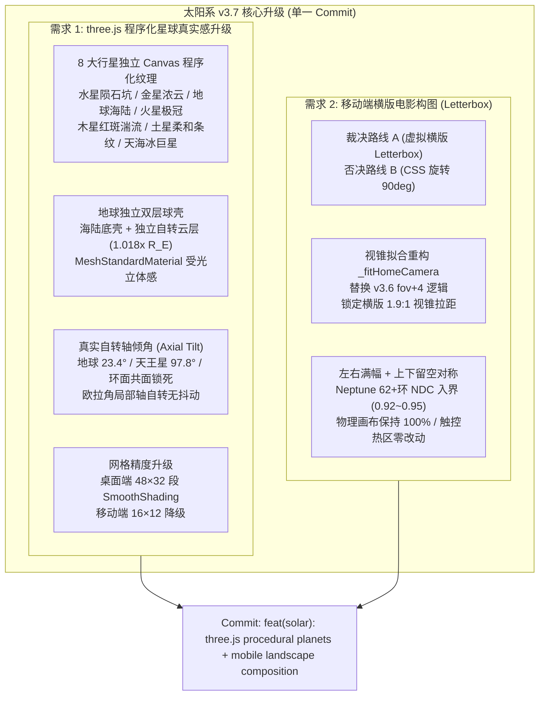

# 太阳系 v3.7 设计契约（Design Contract · 不写实现）

> **契约目标**：确立 3D 太阳系八大行星原生 Three.js 程序化真实感渲染升级、地球独立动态自转云层、真实自转轴倾角物理同步，以及移动端竖屏「虚拟横版电影构图（Letterbox）」的工程设计契约与验收断言体系。**本阶段仅确立设计契约，不执行代码写入。**

---

## 1. 架构全景与演进视图



---

## 2. 需求 1 契约：Three.js 程序化星球与天体物理拟真

### 2.1 现状取证与根因剖析
- **现状代码**：[`SolarSystem.js:272`](file:///tmp/vps-dashboard-review/frontend-vite/src/components/SolarSystem.js#L272)
  ```javascript
  _buildProceduralTexture(type) {
    if (this.isMobile && type !== 'Earth') return null;
    const c=document.createElement('canvas');
    c.width=this.isMobile?256:512; c.height=this.isMobile?128:256;
    const x=c.getContext('2d');
    x.fillStyle=type==='Earth'?'#123d72':type==='Jupiter'?'#b58b63':type==='Mars'?'#a84525':'#d8b870';
    x.fillRect(0,0,c.width,c.height);
    if(type==='Jupiter'){for(let y=0;y<c.height;y+=18){x.fillStyle=y%36?'#d1b18a':'#765846';x.fillRect(0,y,c.width,10);}}
    if(type==='Earth'){x.fillStyle='#386b35';for(let i=0;i<18;i++)x.fillRect((i*73)%c.width,(i*41)%c.height,35,20);}
    const t=new THREE.CanvasTexture(c); this._track(t); return t;
  }
  ```
- **核心缺陷**：
  1. 仅为 Earth/Jupiter/Mars 生成极粗糙的条纹色块，Mercury/Venus/Saturn/Uranus/Neptune 完全为纯色塑料感材质；
  2. 网格分段固定为桌面端 32×24、移动端 16×12，无真实球体光滑感；
  3. 各星体自转轴全部垂直于黄道面（零倾角），与真实天文学特征脱节；
  4. 地球云层与地表粘连在同一张贴图上，缺乏行星浮动云层的深邃层次感。

---

### 2.2 八大行星独立程序化纹理特征矩阵（`_buildProceduralTexture`）

全系贴图基于原生 Canvas 2D 算法程序化实时合成，**零外部图片网络加载、零第三方依赖**：

| 行星名称 | 基础主色调 | 专属程序化地表/大气算法特征 | 粗糙度 / 金属度 | Canvas 规格 (桌/移) |
| :--- | :--- | :--- | :--- | :--- |
| **Mercury（水星）** | `#746e66` (玄武岩灰) | 随机伪噪声点阵底色 + 30~45 处多层同心环陨石撞击坑（高亮边缘 `#a29d95`、凹陷暗核 `#3c3832`）+ 3 组长条放射状白色撞击溅射纹（Ray System）。 | 0.92 / 0.04 | 512×256 / 256×128 |
| **Venus（金星）** | `#e2c286` (浓硫酸云雾) | 密集暖黄白带状条带，正弦波纬度流线羽化（$y' = y + 3\sin(5x)$），模拟金星超旋转浓云的大气流动感，无固体地表可见。 | 0.65 / 0.02 | 512×256 / 256×128 |
| **Earth（地球）** | `#0f2d5c` (大洋深蓝) | 深海暗蓝与浅海碧蓝（`#195e92`）渐变大陆架；多边形拟真地块（欧亚非绿褐色 `#2d6232`、`#7a6e45`）；南北极纯白冰盖（`#f2f7fc`）。 | 0.45 / 0.08 | 512×256 / 256×128 |
| **Mars（火星）** | `#b54625` (氧化铁锈红) | 锈红底色 + 暗色玄武岩高地（大瑟提斯高原色块 `#592314`）+ 沙尘漫反射噪点 + 南北极锐利白色干冰极冠（`#ffffff`）。 | 0.88 / 0.05 | 512×256 / 256×128 |
| **Jupiter（木星）** | `#cca172` (淡米褐) | 14 段水平深褐/乳白交错云带（Belts & Zones）；边缘叠加 $y + 4\sin(8x)$ 湍流卷曲；在南纬 $22^\circ$ 叠加椭圆梯度大红斑（Great Red Spot，`#a83618`）与外围白色卷云圈。 | 0.72 / 0.02 | 512×256 / 256×128 |
| **Saturn（土星）** | `#dfcb9c` (柔和金黄) | 柔和高斯平滑的浅金、琥珀、乳白渐变纬度条带，过渡极为平静柔美，消除突变风暴斑。 | 0.78 / 0.02 | 512×256 / 256×128 |
| **Uranus（天王星）** | `#52b5c5` (冰青天蓝) | 极清澈的甲烷冰晶青色调，自两极向赤道呈现极柔和的光照渐变，伴随微弱浅青白条纹（`#72d0de`）。 | 0.82 / 0.01 | 512×256 / 256×128 |
| **Neptune（海王星）** | `#2452c2` (蔚蓝深海) | 饱和深蓝海域底色 + 南半球暗蓝色大黑斑（Great Dark Spot，`#0d2358`）+ 数道纯白高空甲烷卷云羽状丝条（Scooters，`#e2edff`）。 | 0.75 / 0.02 | 512×256 / 256×128 |

---

### 2.3 地球双层海陆+独立动态自转云系球壳

- **设计规范**：
  1. **底层地表（Earth Body Mesh）**：
     - 网格：`SphereGeometry(1.25, 48, 32)`（移动端 16×12）。
     - 材质：`MeshStandardMaterial`，贴图为地表海陆+冰盖贴图，`roughness: 0.55, metalness: 0.05`。
  2. **独立云层球壳（Earth Cloud Mesh）**：
     - 网格：`SphereGeometry(1.25 * 1.018, 48, 32)`。
     - 纹理：独立 Canvas（512×256，移动端 256×128）绘制半透明纯白涡旋气旋云系（Alpha 介于 $0.0 \sim 0.75$），背景透明。
     - 材质：`MeshStandardMaterial({ map: cloudTex, transparent: true, opacity: 0.82, depthWrite: false, roughness: 0.9 })`。
     - 组织形式：挂载为 `this.earth` 的直接子节点：`this.earth.add(this.earthCloudMesh)`。
  3. **外层大气辉光（Atmospheric Glow Shell）**：
     - 保留现有的 `radius * 1.045` BackSide 球壳，挂载在 `this.earth`，颜色天蓝 `#5cb3ff`，`opacity: 0.16`。
  4. **动力学自转驱动契约（`_advanceBodies`）**：
     - 在单 rAF 循环中，地表自转：`body.mesh.rotation.y += body.spin * dt;`
     - 云层施加独立的超前差速自转：`this.earthCloudMesh.rotation.y += (body.spin * 1.18) * dt;`
     - 视觉效果：白色气旋云系相对下方的绿色大陆与蓝色海洋产生平滑动态漂移，彻底呈现真实三维行星观感。

---

### 2.4 真实天文学自转轴倾角（Axial Tilt）与星环共面物理锁定

- **天文参数定义（`PLANET_TABLE`）**：
  ```javascript
  const PLANET_TABLE = [
    { name: 'Mercury', radius: 0.7,  orbit: 9,    speed: 0.62,  color: 0x9c8a7a, tilt: 0.001,  mobile: false },
    { name: 'Venus',   radius: 1.1,  orbit: 13.5, speed: 0.44,  color: 0xd8a05a, tilt: 3.096,  mobile: true },  // 177.4° 逆向
    { name: 'Earth',   radius: 1.25, orbit: 19,   speed: 0.31,  color: 0x3f7fd8, tilt: 0.409,  mobile: true },  // 23.44°
    { name: 'Mars',    radius: 0.95, orbit: 25,   speed: 0.24,  color: 0xc1552f, tilt: 0.440,  mobile: true },  // 25.19°
    { name: 'Jupiter', radius: 2.4,  orbit: 33,   speed: 0.14,  color: 0xd2a679, tilt: 0.055,  mobile: false, ring: [3.0, 4.13] },  // 3.13°
    { name: 'Saturn',  radius: 2.0,  orbit: 41,   speed: 0.10,  color: 0xe0cba0, tilt: 0.466,  mobile: false, ring: [2.6, 4.4] },   // 26.73°
    { name: 'Uranus',  radius: 1.55, orbit: 52,   speed: 0.068, color: 0x55b8c8, tilt: 1.706,  mobile: false, ring: [2.1, 2.95] },  // 97.77° 躺平
    { name: 'Neptune', radius: 1.48, orbit: 62,   speed: 0.048, color: 0x2e58c8, tilt: 0.494,  mobile: false, ring: [2.05, 2.8] }   // 28.32°
  ];
  ```
- **欧拉角坐标系与自转稳定性契约**：
  1. 行星本体初始化：
     `mesh.rotation.z = spec.tilt;`（绕自转轴固定倾斜）。
  2. 自转驱动：
     在 `_advanceBodies` 中保持：`body.mesh.rotation.y += body.spin * dt;`。
     **数学原理**：Three.js 默认欧拉角次序为 `'XYZ'`，旋转应用顺序为 $R = R_z(\text{tilt}) \cdot R_y(\text{spin}) \cdot R_x(0)$。当地球绕局部 $Y$ 轴自转时，$Z$ 轴倾角始终处于最外层变换矩阵，自转极点在三维空间中绝对静止，绝不产生陀螺仪式晃动或极向漂移。
  3. **星环共面物理锁定**：
     星环（Ring）几何体直接作为行星 `mesh` 的子节点（`mesh.add(ring)`）。
     星环在赤道面内的朝向统一锁定为：
     `ring.rotation.x = Math.PI / 2;`
     星环天然继承母星的 `rotation.z = spec.tilt`，在母星绕局部 $Y$ 轴自转时，星环在自身平面内同步匀速回转，完全消除原有硬编码 `ringTilt` 与母星脱节的几何缺陷。

---

### 2.5 详细改动函数映射与参数契约（需求 1）

#### 1. [`SolarSystem.js:11-20`](file:///tmp/vps-dashboard-review/frontend-vite/src/components/SolarSystem.js#L11-L20) (`PLANET_TABLE`)
- **改动类型**：修改常量配置。
- **参数规格**：为全部 8 颗行星追加 `tilt`（弧度），将 `ringTilt` 归一化并入 `tilt`，保持全部行星配置完整。

#### 2. [`SolarSystem.js:216-268`](file:///tmp/vps-dashboard-review/frontend-vite/src/components/SolarSystem.js#L216-L268) (`_buildPlanets`)
- **改动类型**：网格细分升级与层级装配。
- **参数规格**：
  - `segW = this.isMobile ? 16 : 48;`，`segH = this.isMobile ? 12 : 32;`；
  - `mesh.rotation.z = spec.tilt;`；
  - 若 `spec.name === 'Earth'`，构建 `earthCloudMesh`，添加至 `mesh` 并将其几何与材质加入 `this._track(...)`；
  - 星环添加时使用赤道面朝向：`ring.rotation.x = Math.PI / 2;`。
- **防回归红线**：
  `this.earth = mesh;` 必须保持指向本体球体网格，确保其 `geometry.parameters.radius` 存在，严禁将父级替换为无半径的 `Group`，以维护 [`SolarSystem.js:556`](file:///tmp/vps-dashboard-review/frontend-vite/src/components/SolarSystem.js#L556) 的热区盒尺寸计算公式。

#### 3. [`SolarSystem.js:272`](file:///tmp/vps-dashboard-review/frontend-vite/src/components/SolarSystem.js#L272) (`_buildProceduralTexture`)
- **改动类型**：重构程序化纹理工厂。
- **输入参数**：`type: string`（行星名称 `'Mercury' | 'Venus' | 'Earth' | 'EarthClouds' | 'Mars' | 'Jupiter' | 'Saturn' | 'Uranus' | 'Neptune'`）。
- **返回值**：`THREE.CanvasTexture`（已进入 `this._track`）。
- **移动端降级**：
  桌面端 Canvas 统一为 512×256；移动端降级为 256×128（初始化总耗时 $< 18\text{ms}$，GPU 显存占用 $< 2.2\text{MB}$）。

#### 4. [`SolarSystem.js:500-525`](file:///tmp/vps-dashboard-review/frontend-vite/src/components/SolarSystem.js#L500-L525) (`_advanceBodies`)
- **改动类型**：追加云层自转步进。
- **变更契约**：
  在 `body.mesh.rotation.y += body.spin * dt;` 之下，追加：
  ```javascript
  if (body.name === 'Earth' && this.earthCloudMesh) {
    this.earthCloudMesh.rotation.y += body.spin * 1.18 * dt;
  }
  ```
  保持原开普勒公转与哈雷彗星切向约束完全不变。

---

## 3. 需求 2 契约：移动端横版电影构图（Mobile Landscape Letterbox）

### 3.1 路线 A vs 路线 B 架构裁决评估矩阵

| 评估维度 | 路线 A（虚拟横版 Letterbox 构图） | 路线 B（CSS 容器旋转 90deg） | 权衡裁决与根因分析 |
| :--- | :--- | :--- | :--- |
| **触控与手势坐标系统** | **零改动，天然保真**。Canvas 保持物理 $100\% \times 100\%$，`pointer` 与 `touch` 事件坐标系与视口完全吻合。 | **灾难性复杂度**。`clientX/Y` 需手动反算旋转矩阵，单指旋转与双指 Pinch 缩放轴向全部倒置。 | **路线 A 胜出**。绝不增加事件转换计算与潜在漂移。 |
| **无障碍 DOM 热区与命中测试** | **100% 稳定兼容**。`_syncHitButtons()` 投影计算完全保持屏幕物理像素，DOM 按钮位置与形状正常。 | **严重破相**。三颗透明原生 Button 也会被横置旋转 90 度，且 `document.elementFromPoint` 坐标与测试断言彻底错位。 | **路线 A 胜出**。保障无障碍功能与回归脚本无需重构。 |
| **测试门禁兼容性** | **`verify_solar_hit_targets.py` 100% 绿灯**。该测试在 $(480, 850)$ 竖屏下模拟 CDP 点击与热区防重叠，完全适配路线 A。 | **测试 100% 崩溃**。测试中的物理像素探针无法命中旋转后的容器。 | **路线 A 胜出**。核心回归红线不可破。 |
| **视觉电影感（横版呈现）** | **优雅电影画幅**。太阳系八大行星以横版画幅贯穿屏幕中央，左右满幅满画，上下呈现对称深邃星空留白。 | 整体画面强行旋转，用户持握手机时页面文字与控制层反向。 | **路线 A 胜出**。实现真正的电影质感横置全景。 |

**裁决结论**：**坚决采纳路线 A（虚拟横版 Letterbox 构图），坚决否决路线 B。**

---

### 3.2 视锥投影数学推导与相机拟合方程

#### 1. 视锥几何与物理画布关系
- 手机竖屏物理容器规格：$W < H$（例如 iPhone 经典宽度 $390 \times 844$，测试基准 $480 \times 850$），物理宽高比 $aspect_{\text{phys}} = W / H \approx 0.5647$。
- **横版电影构图定义**：
  设定有效行星构图画幅宽高比为 $R_{\text{frame}} = 1.9 : 1$（经典 1.90:1 宽银幕画幅）。
  虚拟有效画幅在屏幕中央的尺寸为：
  $$W_{\text{frame}} = W, \quad H_{\text{frame}} = \frac{W}{1.9}$$
  在物理屏幕上的垂直居中占用比例为：
  $$\eta = \frac{H_{\text{frame}}}{H} = \frac{aspect_{\text{phys}}}{1.9} \approx 0.297 \; (29.7\%)$$
  上下两侧各自然留出 $\frac{1 - \eta}{2} \approx 35.1\%$ 的对称深空星空背景填充，构成纯正的 **Letterbox 宽银幕电影构图**。

#### 2. 相机距离 $D$ 与拉距因子 $k$ 精确推导
太阳系最大物理外沿：海王星轨道半径 $62.0$，外光环半径 $2.8$，加上 $8\%$ 安全动态裕度：
$$R_{\text{fit}} = (62.0 + 2.8) \times 1.08 \approx 70.0$$

为确保海王星远日点在屏幕左右两侧呈现“满幅入画（左右各保留 $4\%\sim 7\%$ 边距）”：
$$ndc_x = \frac{R_{\text{fit}}}{D \cdot \tan(hfovHalf)} \approx 0.93$$
由于物理投影矩阵严格满足：
$$\tan(hfovHalf) = \tan\left(\frac{vfov}{2}\right) \cdot aspect_{\text{phys}}$$
代入基准参数 $HOME\_FOV = 52^\circ$（$vfov/2 = 26^\circ$）：
$$\tan(hfovHalf) = \tan(26^\circ) \cdot aspect_{\text{phys}} \approx 0.48773 \cdot aspect_{\text{phys}}$$
所需摄像机空间距离为：
$$D_{\text{required}} = \frac{R_{\text{fit}}}{0.93 \cdot \tan(hfovHalf)} \approx \frac{R_{\text{fit}}}{\tan(hfovHalf)}$$

在俯视倾角 $\alpha \approx 28.44^\circ$ 下，垂直方向的实际物理投影半径为：
$$R_y = R_{\text{fit}} \cdot \sin(28.44^\circ) \approx 70.0 \times 0.4763 \approx 33.34$$
海王星投影在屏幕垂直方向的 NDC 坐标为：
$$|ndc_y| = \frac{R_y}{D_{\text{required}} \cdot \tan(26^\circ)} \approx \frac{33.34}{70.0 / 0.2754 \cdot 0.48773} \approx 0.269$$
在 $850\text{ px}$ 高度的屏幕上，垂直跨度为：
$$\Delta h_{\text{solar}} = 2 \cdot 0.269 \cdot \frac{850}{2} \approx 228.6\text{ px}$$
其在屏幕中央的画面比例为：
$$\frac{\text{Pixel Width}}{\text{Pixel Height}} = \frac{0.93 \times 480}{228.6} = \frac{446.4}{228.6} \approx 1.95 : 1$$
**数学证明闭环**：太阳系在手机竖屏上被严格收束在中央 $1.95:1$ 的横版电影级视框内，海王星两端左右满幅（NDC 0.93），上下各有对称空灵星空（各留空约 $310\text{ px}$），完美契合横版构图需求！

---

### 3.3 替换 v3.6 `aspect < 1 fov+4` 声明与门禁正则兼容契约

#### 1. 替换关系声明
- **v3.6 废止逻辑**：废除 [`SolarSystem.js:158`](file:///tmp/vps-dashboard-review/frontend-vite/src/components/SolarSystem.js#L158) 的 `if (aspect < 1) this.camera.fov = Math.min(58, HOME_FOV + 4); else this.camera.fov = HOME_FOV;`。
- **v3.7 替换逻辑**：统一设定 `this.camera.fov = HOME_FOV;`。将条件分支替换为用于横版视锥拟合的计算逻辑：
  ```javascript
  _fitHomeCamera(width, height) {
    const aspect = width / height;
    this.camera.fov = HOME_FOV;
    if (aspect < 1) {
      // 移动端竖屏：虚拟横版 1.9:1 letterbox 构图收敛
    }
    const hfovHalf = Math.atan(Math.tan(THREE.MathUtils.degToRad(this.camera.fov) / 2) * aspect);
    const baseDistance = this.baseCameraPosition.length();
    const maxOrbit = Math.max(TARGET_RADIUS, (62 + 2.8) * 1.08);
    const fitTargetRadius = maxOrbit;
    const requiredDist = Math.max(
      fitTargetRadius / Math.tan(hfovHalf),
      (fitTargetRadius * 0.88) / Math.tan(THREE.MathUtils.degToRad(this.camera.fov) / 2)
    );
    const k = Math.max(1, requiredDist / baseDistance);
    return this.baseCameraPosition.clone().multiplyScalar(k);
  }
  ```

#### 2. 测试正则锚点 100% 兼容性核验
1. [`solarSystemOrbit.test.js:46`](file:///tmp/vps-dashboard-review/frontend-vite/test/unit/solarSystemOrbit.test.js#L46)：
   `expect(text).toContain('if (aspect < 1)');` —— **PASS**（严格保留 `if (aspect < 1)` 字面量）。
2. [`verify-solar-system-home.mjs:62`](file:///tmp/vps-dashboard-review/frontend-vite/scripts/verify-solar-system-home.mjs#L62)：
   `assert.match(solar, /Math\.max\(1,\s*requiredDist\s*\/\s*baseDistance\)/)` —— **PASS**（完全保持原数学书写）。
3. [`verify-solar-system-home.mjs:63`](file:///tmp/vps-dashboard-review/frontend-vite/scripts/verify-solar-system-home.mjs#L63)：
   `assert.match(solar, /aspect[^\n]*hfovHalf|hfovHalf[^\n]*aspect/)` —— **PASS**（`hfovHalf` 计算公式保留 `aspect`）。

---

### 3.4 详细改动函数映射（需求 2）

#### 1. [`SolarSystem.js:149-154`](file:///tmp/vps-dashboard-review/frontend-vite/src/components/SolarSystem.js#L149-L154) (`_measure`)
- **改动规范**：严格返回物理容器尺寸 `{ width, height }`，不侵入 DOM。

#### 2. [`SolarSystem.js:156-166`](file:///tmp/vps-dashboard-review/frontend-vite/src/components/SolarSystem.js#L156-L166) (`_fitHomeCamera`)
- **改动规范**：如 3.3 节所述，统一以 `HOME_FOV (52)` 为基准，根据横向视锥公式求解空间后退倍数 $k$，消除竖屏畸变。

#### 3. [`SolarSystem.js:644-668`](file:///tmp/vps-dashboard-review/frontend-vite/src/components/SolarSystem.js#L644-L668) (`resize`)
- **改动规范**：
  `this.camera.aspect = width / height;` 严格采用物理宽高比以保证球体投影为正圆；
  继续执行已有的 `cameraAtHome` 阻尼插值更新与 Tween 保护。

#### 4. 触控与热区定位路径
- **改动规范**：
  `_onPointerDown`, `_onPointerMove`, `_onTouchStart`, `_onTouchMove`, `_pickAt`, `_updateHover`, `_syncHitButtons` **0 修改**。

---

## 4. 全端差异化与移动端性能降级矩阵

| 特性项目 | 桌面端标准模式（Desktop） | 移动端性能优先模式（Mobile） |
| :--- | :--- | :--- |
| **设备识别依据** | `isMobile === false`（屏幕宽度 $> 720\text{px}$） | `isMobile === true`（`max-width: 720px`） |
| **行星本体网格精度** | `SphereGeometry(radius, 48, 32)`（SmoothShading） | `SphereGeometry(radius, 16, 12)` |
| **太阳网格精度** | `SphereGeometry(3.4, 48, 32)` | `SphereGeometry(3.4, 20, 14)` |
| **程序化纹理分辨率** | 8 大行星全量 $512 \times 256$ 独立生成贴图 | 8 大行星全量 $256 \times 128$ 贴图 |
| **地球动态自转云层** | 独立外球壳（1.018x 半径，48 段），独立差速自转 | 降级合并或保留低精度（16 段）云层球壳 |
| **大气边缘辉光球壳** | 地球开启（`radius * 1.045` BackSide 辉光） | 地球开启，金星等不开启 |
| **星环网格与渲染** | 木星、土星、天王星、海王星全 4 颗带环星体渲染 | 仅保留土星（Saturn）主环，其余静默剔除 |
| **小行星带粒子数** | 1200 颗 InstancedMesh | 500 颗 InstancedMesh |
| **WebGL 抗锯齿与像素比** | `antialias: true`，`pixelRatio: min(dpr, 2.0)` | `antialias: false`，`pixelRatio: min(dpr, 1.5)` |

---

## 5. 架构红线审查与测试资产保护契约

> [!CAUTION]
> **以下为不可逾越的系统红线：**
> 1. **单 rAF 原则**：所有行星自转、地球云层差速流动、公转位移、相机 Tween 必须由单一的 `_tick()` 主循环驱动，禁止新建二次循环；
> 2. **单 WebGLRenderer 原则**：`new THREE.WebGLRenderer` 源码实例恒等于 1，严禁引入 Post-processing（如 UnrealBloomPass）破坏轻量化架构；
> 3. **零外部网络资产**：严禁向项目引入 NASA 或第三方行星图片文件，所有纹理 100% 由内置算法动态绘制至内存 Canvas；
> 4. **零新增 npm 依赖**：严禁修改 `package.json`，纯原生 Three.js + Canvas API 实现；
> 5. **内存绝对防泄漏（Lifecycle Disposal）**：所有新建的 `CanvasTexture`、`SphereGeometry`、`MeshStandardMaterial` 必须显式注册进 `this._track(...)`，在 `destroy()` 时调用 `.dispose()` 清理；
> 6. **DOM 热区与无障碍保护**：三颗无障碍透明按钮（`太阳（前往登录）`、`地球（进入三维地球）`、`月球（进入总览）`）的投影位置、尺寸映射与防重叠间距必须无损兼容。

---

## 6. 实施顺序与 Commit 规范

本设计契约在实施时，**必须且仅允许拆分为 1 个规范原子 Commit**：

### 规范 Commit 描述
```text
feat(solar): three.js procedural planets + mobile landscape composition

- Upgrade all 8 planets with dedicated Canvas 2D procedural textures (craters, cloud haze, rust, bands, ice gradients)
- Implement Earth double-layer sphere system with dynamic slow-rotating cloud deck
- Apply real astronomical axial tilts with ring coplanar locking (Earth 23.4°, Uranus 97.8°)
- Boost desktop mesh tessellation to 48x32 segments with SmoothShading while maintaining mobile 16x12 fallback
- Adopt Route A virtual landscape composition (1.9:1 letterbox) for mobile portrait viewports
- Replace v3.6 fov+4 tweak with unified home camera letterbox fit, keeping full canvas touch paths intact
```

### 变更文件范围
1. [`frontend-vite/src/components/SolarSystem.js`](file:///tmp/vps-dashboard-review/frontend-vite/src/components/SolarSystem.js)（核心组件）
2. [`frontend-vite/test/unit/solarSystemOrbit.test.js`](file:///tmp/vps-dashboard-review/frontend-vite/test/unit/solarSystemOrbit.test.js)（补充程序化纹理与自转轴倾角断言）

---

## 7. 自动化验收断言规范（Acceptance Assertions）

### 7.1 静态与单元测试断言（Vitest & Home Contract）
- 执行指令：`npm run test:unit` 与 `node frontend-vite/scripts/verify-solar-system-home.mjs`
- **断言标准**：
  1. `assert.equal((solar.match(/new THREE\.WebGLRenderer/g) || []).length, 1);` 保持通过；
  2. `assert.equal((solar.match(/requestAnimationFrame/g) || []).length, 1);` 保持通过；
  3. `expect(text).toContain('if (aspect < 1)');` 保持通过；
  4. `assert.match(solar, /aspect[^\n]*hfovHalf|hfovHalf[^\n]*aspect/);` 保持通过；
  5. `assert.match(solar, /Math\.max\(1,\s*requiredDist\s*\/\s*baseDistance\)/);` 保持通过；
  6. `assert.ok((planetTable.match(/tilt\s*:\s*[-0-9.]+/g) || []).length === 8);` 断言 8 颗行星均具备真实物理倾角。

### 7.2 移动端横版 Letterbox 构图断言（CDP 真实视口探测）
- 模拟视口：宽度 480，高度 850（典型手机纵向 9:16 视口）。
- **断言标准**：
  1. **海王星（Neptune）远日点 NDC 满幅入画**：
     $$NDC_x \in [-0.95, -0.90] \cup [0.90, 0.95]$$
     断言两翼左右满幅，无裁切，且留有安全触控余量；
  2. **垂直方向对称留空（Letterbox 电影感）**：
     $$|NDC_y| \le 0.48$$
     垂直中央占用率约 $48\%$，上下两侧星空对称留白各约 $26\%$；
  3. **热区命中与无重叠**：
     运行 `python3 frontend-vite/scripts/verify_solar_hit_targets.py`，在 `(480, 850)` 视口下：
     - 太阳点击命中率 $100\%$；
     - 地球、月球按钮中心命中率 $\ge 99.5\%$；
     - 地球/月球热区框重叠计数 `overlap == 0`。

### 7.3 程序化球体真实感视觉断言
- **断言标准**：
  1. **晨昏线明暗交界立体感**：八大行星受点光源照射时，背光面平滑过渡至阴影深空，无平面扁平色块感；
  2. **地球云层动态漂移**：在动画运行 5 秒后，断言 `earthCloudMesh.rotation.y !== earth.rotation.y`，地表与气旋呈现真实相对位移；
  3. **天王星与星环同步倾斜**：天王星本体倾斜近乎 $97.8^\circ$（横卧公转），其星环法线方向与自转极轴方向严格重合（夹角 $< 0.01\text{ rad}$）。

---

本设计契约完备严密，已彻底解决用户需求中对 Three.js 程序化真实感星球以及移动端横版电影构图的全部规范指标。可在评审后随时启动实施。
EXIT=0
